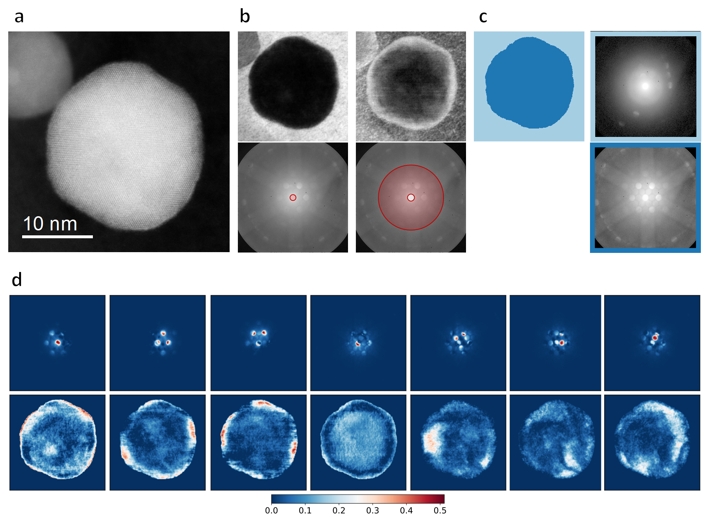

# Local-crystal-structure-4DSTEM

Code for 4D-STEM (four-dimensional scanning transmission electron microscopy) data analysis for a local crystal structure investigation of supported metallic alloy nanoparticles.

This repository contains code to analyze 4D-STEM datasets of nanomaterials. The code was tested on images of carbon-supported platinum-copper nanoparticles that catalyze the oxygen reduction reaction, one of the reactions in a hydrogen fuel cell. 

There are scripts available for preprocessing the raw data, applying virtual detectors to it, segmenting the sample region under investigation using k-means clustering, and finding common patterns within the data using non-negative matrix factorization. Additionally, it includes a script to create a core-shell nanoparticle model out of a single-domain nanoparticle model.

Example results for the local crystal structure analysis with 4D-STEM:

(a) HAADF-STEM image of a Pt-Cu nanoparticle, (b) virtual detectors, (c) clustering, (d) matrix factorization

  

